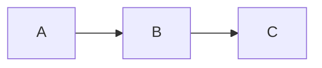

# v0.2 Smoke Test (v0.2.8 -> v0.2.11)

[toc]

## Section A — v0.2.8 Document-mode parity

This paragraph contains a memo: %% reviewer note: this is a memo %% and continues after.

CriticMarkup samples on a single paragraph: It is {++inserted++} text, with {--deleted--} parts, a {~~old~>new~~} substitution, a {==marked==} span, and a {>>reviewer comment<<} pill.

(Verification: In Document mode, place caret on EACH of the above lines. None of `%%` or `{...}` braces should be visible — should render as 💬 / colored marks.)

## Section B — v0.2.9 Live preview parity

Inline marks: ==highlighted text==, H~2~O, X^2^, plus inline <mark>HTML mark</mark> for parity.

Inline HTML coverage: <mark>marked</mark>, H<sub>2</sub>O, X<sup>2</sup>, press <kbd>Cmd+S</kbd>, <u>underlined</u>.

> [!NOTE]
> A blue note callout with the "Note" header label.

> [!TIP]
> A green tip callout.

> [!IMPORTANT]
> A purple important callout.

> [!WARNING]
> An amber warning callout.

> [!CAUTION]
> A red caution callout.

Nested blockquote (should NOT promote to alert):
> > [!NOTE]
> > This is a nested blockquote, not a styled alert.

## Section C — v0.2.10 Round-trip + export

A 3-column table with alignment:

| Left | Center | Right |
|:-----|:------:|------:|
| One  | Two    | Three |
| Four | Five   | Six   |

Inline math: $E = mc^2$. Block math:

$$
\int_0^\infty e^{-x^2} dx = \frac{\sqrt{\pi}}{2}
$$

Mermaid diagram:



Citation: [@key2024] and group [@a; @b].

Footnote reference[^1].

[^1]: This is the footnote definition.

A code fence:

```typescript
function hello() { return "world"; }
```

Image (will not load unless durumi-asset:// resolves; the alt text matters):


## Section D — v0.2.11 IME + a11y

Korean composition test targets (for reading, not interactive):
- Inside bold: **한국어** text
- Inside italic: *한국어* text
- Inside citation: [@한국어key]
- Inside memo: %% 한국어 메모 %%
- Inside CM insert: {++한국어 추가++}
- In a table cell: see Section C table

(The IME composition matrix is exercised by e2e/ime-composition.spec.ts; this section is mainly for Korean rendering visual check.)

## Section E — Long-doc mode-switch preservation target

Add ~80 short paragraphs of placeholder text below this so the doc exceeds 100 visible lines and we can scroll to ~line 50 for the mode-switch test:

Paragraph 1: lorem ipsum dolor sit amet, consectetur adipiscing elit, sed do eiusmod tempor incididunt ut labore et dolore magna aliqua.

Paragraph 2: lorem ipsum dolor sit amet, consectetur adipiscing elit, sed do eiusmod tempor incididunt ut labore et dolore magna aliqua.

Paragraph 3: lorem ipsum dolor sit amet, consectetur adipiscing elit, sed do eiusmod tempor incididunt ut labore et dolore magna aliqua.

Paragraph 4: lorem ipsum dolor sit amet, consectetur adipiscing elit, sed do eiusmod tempor incididunt ut labore et dolore magna aliqua.

Paragraph 5: lorem ipsum dolor sit amet, consectetur adipiscing elit, sed do eiusmod tempor incididunt ut labore et dolore magna aliqua.

Paragraph 6: lorem ipsum dolor sit amet, consectetur adipiscing elit, sed do eiusmod tempor incididunt ut labore et dolore magna aliqua.

Paragraph 7: lorem ipsum dolor sit amet, consectetur adipiscing elit, sed do eiusmod tempor incididunt ut labore et dolore magna aliqua.

Paragraph 8: lorem ipsum dolor sit amet, consectetur adipiscing elit, sed do eiusmod tempor incididunt ut labore et dolore magna aliqua.

Paragraph 9: lorem ipsum dolor sit amet, consectetur adipiscing elit, sed do eiusmod tempor incididunt ut labore et dolore magna aliqua.

Paragraph 10: lorem ipsum dolor sit amet, consectetur adipiscing elit, sed do eiusmod tempor incididunt ut labore et dolore magna aliqua.

Paragraph 11: lorem ipsum dolor sit amet, consectetur adipiscing elit, sed do eiusmod tempor incididunt ut labore et dolore magna aliqua.

Paragraph 12: lorem ipsum dolor sit amet, consectetur adipiscing elit, sed do eiusmod tempor incididunt ut labore et dolore magna aliqua.

Paragraph 13: lorem ipsum dolor sit amet, consectetur adipiscing elit, sed do eiusmod tempor incididunt ut labore et dolore magna aliqua.

Paragraph 14: lorem ipsum dolor sit amet, consectetur adipiscing elit, sed do eiusmod tempor incididunt ut labore et dolore magna aliqua.

Paragraph 15: lorem ipsum dolor sit amet, consectetur adipiscing elit, sed do eiusmod tempor incididunt ut labore et dolore magna aliqua.

Paragraph 16: lorem ipsum dolor sit amet, consectetur adipiscing elit, sed do eiusmod tempor incididunt ut labore et dolore magna aliqua.

Paragraph 17: lorem ipsum dolor sit amet, consectetur adipiscing elit, sed do eiusmod tempor incididunt ut labore et dolore magna aliqua.

Paragraph 18: lorem ipsum dolor sit amet, consectetur adipiscing elit, sed do eiusmod tempor incididunt ut labore et dolore magna aliqua.

Paragraph 19: lorem ipsum dolor sit amet, consectetur adipiscing elit, sed do eiusmod tempor incididunt ut labore et dolore magna aliqua.

Paragraph 20: lorem ipsum dolor sit amet, consectetur adipiscing elit, sed do eiusmod tempor incididunt ut labore et dolore magna aliqua.

Paragraph 21: lorem ipsum dolor sit amet, consectetur adipiscing elit, sed do eiusmod tempor incididunt ut labore et dolore magna aliqua.

Paragraph 22: lorem ipsum dolor sit amet, consectetur adipiscing elit, sed do eiusmod tempor incididunt ut labore et dolore magna aliqua.

Paragraph 23: lorem ipsum dolor sit amet, consectetur adipiscing elit, sed do eiusmod tempor incididunt ut labore et dolore magna aliqua.

Paragraph 24: lorem ipsum dolor sit amet, consectetur adipiscing elit, sed do eiusmod tempor incididunt ut labore et dolore magna aliqua.

Paragraph 25: lorem ipsum dolor sit amet, consectetur adipiscing elit, sed do eiusmod tempor incididunt ut labore et dolore magna aliqua.

Paragraph 26: lorem ipsum dolor sit amet, consectetur adipiscing elit, sed do eiusmod tempor incididunt ut labore et dolore magna aliqua.

Paragraph 27: lorem ipsum dolor sit amet, consectetur adipiscing elit, sed do eiusmod tempor incididunt ut labore et dolore magna aliqua.

Paragraph 28: lorem ipsum dolor sit amet, consectetur adipiscing elit, sed do eiusmod tempor incididunt ut labore et dolore magna aliqua.

Paragraph 29: lorem ipsum dolor sit amet, consectetur adipiscing elit, sed do eiusmod tempor incididunt ut labore et dolore magna aliqua.

Paragraph 30: lorem ipsum dolor sit amet, consectetur adipiscing elit, sed do eiusmod tempor incididunt ut labore et dolore magna aliqua.

Paragraph 31: lorem ipsum dolor sit amet, consectetur adipiscing elit, sed do eiusmod tempor incididunt ut labore et dolore magna aliqua.

Paragraph 32: lorem ipsum dolor sit amet, consectetur adipiscing elit, sed do eiusmod tempor incididunt ut labore et dolore magna aliqua.

Paragraph 33: lorem ipsum dolor sit amet, consectetur adipiscing elit, sed do eiusmod tempor incididunt ut labore et dolore magna aliqua.

Paragraph 34: lorem ipsum dolor sit amet, consectetur adipiscing elit, sed do eiusmod tempor incididunt ut labore et dolore magna aliqua.

Paragraph 35: lorem ipsum dolor sit amet, consectetur adipiscing elit, sed do eiusmod tempor incididunt ut labore et dolore magna aliqua.

Paragraph 36: lorem ipsum dolor sit amet, consectetur adipiscing elit, sed do eiusmod tempor incididunt ut labore et dolore magna aliqua.

Paragraph 37: lorem ipsum dolor sit amet, consectetur adipiscing elit, sed do eiusmod tempor incididunt ut labore et dolore magna aliqua.

Paragraph 38: lorem ipsum dolor sit amet, consectetur adipiscing elit, sed do eiusmod tempor incididunt ut labore et dolore magna aliqua.

Paragraph 39: lorem ipsum dolor sit amet, consectetur adipiscing elit, sed do eiusmod tempor incididunt ut labore et dolore magna aliqua.

Paragraph 40: lorem ipsum dolor sit amet, consectetur adipiscing elit, sed do eiusmod tempor incididunt ut labore et dolore magna aliqua.

Paragraph 41: lorem ipsum dolor sit amet, consectetur adipiscing elit, sed do eiusmod tempor incididunt ut labore et dolore magna aliqua.

Paragraph 42: lorem ipsum dolor sit amet, consectetur adipiscing elit, sed do eiusmod tempor incididunt ut labore et dolore magna aliqua.

Paragraph 43: lorem ipsum dolor sit amet, consectetur adipiscing elit, sed do eiusmod tempor incididunt ut labore et dolore magna aliqua.

Paragraph 44: lorem ipsum dolor sit amet, consectetur adipiscing elit, sed do eiusmod tempor incididunt ut labore et dolore magna aliqua.

Paragraph 45: lorem ipsum dolor sit amet, consectetur adipiscing elit, sed do eiusmod tempor incididunt ut labore et dolore magna aliqua.

Paragraph 46: lorem ipsum dolor sit amet, consectetur adipiscing elit, sed do eiusmod tempor incididunt ut labore et dolore magna aliqua.

Paragraph 47: lorem ipsum dolor sit amet, consectetur adipiscing elit, sed do eiusmod tempor incididunt ut labore et dolore magna aliqua.

Paragraph 48: lorem ipsum dolor sit amet, consectetur adipiscing elit, sed do eiusmod tempor incididunt ut labore et dolore magna aliqua.

Paragraph 49: lorem ipsum dolor sit amet, consectetur adipiscing elit, sed do eiusmod tempor incididunt ut labore et dolore magna aliqua.

Paragraph 50: lorem ipsum dolor sit amet, consectetur adipiscing elit, sed do eiusmod tempor incididunt ut labore et dolore magna aliqua.

Paragraph 51: lorem ipsum dolor sit amet, consectetur adipiscing elit, sed do eiusmod tempor incididunt ut labore et dolore magna aliqua.

Paragraph 52: lorem ipsum dolor sit amet, consectetur adipiscing elit, sed do eiusmod tempor incididunt ut labore et dolore magna aliqua.

Paragraph 53: lorem ipsum dolor sit amet, consectetur adipiscing elit, sed do eiusmod tempor incididunt ut labore et dolore magna aliqua.

Paragraph 54: lorem ipsum dolor sit amet, consectetur adipiscing elit, sed do eiusmod tempor incididunt ut labore et dolore magna aliqua.

Paragraph 55: lorem ipsum dolor sit amet, consectetur adipiscing elit, sed do eiusmod tempor incididunt ut labore et dolore magna aliqua.

Paragraph 56: lorem ipsum dolor sit amet, consectetur adipiscing elit, sed do eiusmod tempor incididunt ut labore et dolore magna aliqua.

Paragraph 57: lorem ipsum dolor sit amet, consectetur adipiscing elit, sed do eiusmod tempor incididunt ut labore et dolore magna aliqua.

Paragraph 58: lorem ipsum dolor sit amet, consectetur adipiscing elit, sed do eiusmod tempor incididunt ut labore et dolore magna aliqua.

Paragraph 59: lorem ipsum dolor sit amet, consectetur adipiscing elit, sed do eiusmod tempor incididunt ut labore et dolore magna aliqua.

Paragraph 60: lorem ipsum dolor sit amet, consectetur adipiscing elit, sed do eiusmod tempor incididunt ut labore et dolore magna aliqua.

Paragraph 61: lorem ipsum dolor sit amet, consectetur adipiscing elit, sed do eiusmod tempor incididunt ut labore et dolore magna aliqua.

Paragraph 62: lorem ipsum dolor sit amet, consectetur adipiscing elit, sed do eiusmod tempor incididunt ut labore et dolore magna aliqua.

Paragraph 63: lorem ipsum dolor sit amet, consectetur adipiscing elit, sed do eiusmod tempor incididunt ut labore et dolore magna aliqua.

Paragraph 64: lorem ipsum dolor sit amet, consectetur adipiscing elit, sed do eiusmod tempor incididunt ut labore et dolore magna aliqua.

Paragraph 65: lorem ipsum dolor sit amet, consectetur adipiscing elit, sed do eiusmod tempor incididunt ut labore et dolore magna aliqua.

Paragraph 66: lorem ipsum dolor sit amet, consectetur adipiscing elit, sed do eiusmod tempor incididunt ut labore et dolore magna aliqua.

Paragraph 67: lorem ipsum dolor sit amet, consectetur adipiscing elit, sed do eiusmod tempor incididunt ut labore et dolore magna aliqua.

Paragraph 68: lorem ipsum dolor sit amet, consectetur adipiscing elit, sed do eiusmod tempor incididunt ut labore et dolore magna aliqua.

Paragraph 69: lorem ipsum dolor sit amet, consectetur adipiscing elit, sed do eiusmod tempor incididunt ut labore et dolore magna aliqua.

Paragraph 70: lorem ipsum dolor sit amet, consectetur adipiscing elit, sed do eiusmod tempor incididunt ut labore et dolore magna aliqua.

Paragraph 71: lorem ipsum dolor sit amet, consectetur adipiscing elit, sed do eiusmod tempor incididunt ut labore et dolore magna aliqua.

Paragraph 72: lorem ipsum dolor sit amet, consectetur adipiscing elit, sed do eiusmod tempor incididunt ut labore et dolore magna aliqua.

Paragraph 73: lorem ipsum dolor sit amet, consectetur adipiscing elit, sed do eiusmod tempor incididunt ut labore et dolore magna aliqua.

Paragraph 74: lorem ipsum dolor sit amet, consectetur adipiscing elit, sed do eiusmod tempor incididunt ut labore et dolore magna aliqua.

Paragraph 75: lorem ipsum dolor sit amet, consectetur adipiscing elit, sed do eiusmod tempor incididunt ut labore et dolore magna aliqua.

Paragraph 76: lorem ipsum dolor sit amet, consectetur adipiscing elit, sed do eiusmod tempor incididunt ut labore et dolore magna aliqua.

Paragraph 77: lorem ipsum dolor sit amet, consectetur adipiscing elit, sed do eiusmod tempor incididunt ut labore et dolore magna aliqua.

Paragraph 78: lorem ipsum dolor sit amet, consectetur adipiscing elit, sed do eiusmod tempor incididunt ut labore et dolore magna aliqua.

Paragraph 79: lorem ipsum dolor sit amet, consectetur adipiscing elit, sed do eiusmod tempor incididunt ut labore et dolore magna aliqua.

Paragraph 80: lorem ipsum dolor sit amet, consectetur adipiscing elit, sed do eiusmod tempor incididunt ut labore et dolore magna aliqua.

(Verification: scroll to ~line 50 of this section, switch modes 4 times, caret + scroll should survive within ±20px.)

## Section F — Heading levels

# H1 ATX heading
## H2 ATX heading
### H3 ATX heading
#### H4 ATX heading
##### H5 ATX heading
###### H6 ATX heading

Setext H1
=========

Setext H2
---------

(Verification: All six ATX levels render with descending sizes; the two Setext blocks render as styled H1/H2 with the underline rules hidden when the caret is off.)

## Section G — Lists in depth

Task list states (checked / unchecked / mixed / nested):

- [x] Completed task
- [ ] Open task
- [x] Another done item
- [ ] Open with nested:
  - [x] Nested done
  - [ ] Nested open
    - [ ] Triple-nested still pending

Ordered list with start = 5:

5. Fifth item
6. Sixth item
7. Seventh item

Three-level nested list:

- Level 1 alpha
  - Level 2 alpha
    - Level 3 alpha
    - Level 3 beta
  - Level 2 beta
- Level 1 beta

Mixed bullet + numbered:

1. First numbered
   - Bulleted child
   - Another bulleted child
     1. Numbered grandchild
     2. Another numbered grandchild
2. Second numbered

(Verification: checkboxes render as boxes in Document mode; ordered list starts at 5; nesting indents survive 3 levels deep.)

## Section H — Links variants

- Inline link: [Durumi homepage](https://example.com/durumi)
- Bare URL (autolink-on-export): https://example.com/bare
- Autolink: <https://example.com/autolink>
- Reference link: [reference text][refkey] resolves below.
- Orphan reference: [orphan label][nope] should remain literal.
- Email autolink: <user@example.com>

[refkey]: https://example.com/reference-target

(Verification: 5 of 6 render as clickable links; the orphan reference stays as raw bracket syntax.)

## Section I — Code variants

Inline code with backticks: `const answer = 42;` and a second `inline_snippet`.

Fenced code with language tag (typescript):

```typescript
function greet(name: string): string {
  return `Hello, ${name}!`;
}
```

Fenced code with language tag (python):

```python
def fib(n):
    a, b = 0, 1
    for _ in range(n):
        a, b = b, a + b
    return a
```

Fenced code with language tag (bash):

```bash
#!/usr/bin/env bash
set -euo pipefail
for f in *.md; do
  echo "Processing $f"
done
```

Fenced code with no language:

```
plain text
no syntax highlighting expected
```

Indented code block (4-space indent):

    indented_code = True
    still_indented = "yes"
    third_line()

Code block with very long lines (overflow check):

```typescript
const reallyLongIdentifierThatJustKeepsGoingAndGoingAndGoingAndGoingAndGoingAndGoingAndGoingAndGoingAndGoingAndGoingAndGoingAndGoingAndGoing = "and this string just keeps going too so we can verify how the code block handles horizontal overflow without breaking the layout of the editor";
```

(Verification: language-tagged blocks show syntax colors; the no-language block is plain mono; indented block renders as code; the overflow line either wraps or scrolls horizontally without bleeding into the gutter.)

## Section J — Citation variants

- Single citation: [@key2024]
- Suppressed author: [-@key2024]
- Group citation: [@a2020; @b2021; @c2022]
- Missing key: [@nope] — should render `[?]` per the bibliography contract.
- With locator: [@key2024, p. 42]

(Verification: each citation pill renders with the appropriate label; the missing-key pill shows `[?]` rather than the raw `[@nope]`.)

## Section K — Footnote

Single reference[^a].

Multiple references back-to-back[^a][^b][^c].

Orphan reference[^missing] should remain literal.

[^a]: First note.
[^b]: Multi-line note that
      continues on a second line
      with indented continuation.
[^c]: Third note.

(Verification: footnote markers render as superscript pills; orphan stays raw; multi-line def keeps its continuation lines.)

## Section L — Math variants

Inline math, multiple per paragraph: $E = mc^2$ and $a^2 + b^2 = c^2$ and $\pi r^2$.

Block math:

$$
\int_0^\infty e^{-x^2} dx = \frac{\sqrt{\pi}}{2}
$$

Math with special chars: $\alpha + \beta = \gamma$ and $\sum_{i=1}^{n} i = \frac{n(n+1)}{2}$.

Bad math (error case): $\unclosed$ should fall back to source or show an error pill.

(Verification: KaTeX renders inline + block correctly; special chars render Greek letters and summation; bad math degrades gracefully.)

## Section M — Edge cases

Empty alert (no body):

> [!NOTE]

Empty memo: %% %%

Empty CriticMarkup spans: {++++}, {----}, {== ==}, {>><<}, {~~~>~~}

Adjacent marks (no space): **bold***italic*

Marks at line edges:
**bold-at-start** of line.

Trailing **bold-at-end-of-line**

(Verification: empty containers don't crash the renderer; adjacent bold/italic still emit two distinct emphasis spans; line-edge marks render correctly without leaking into the next paragraph.)

## Section N — Front matter variants

The document already has minimal front matter. The expanded variant the orchestrator may swap in for export checks:

```yaml
---
title: Durumi v0.2 Smoke Test Fixture (expanded)
author: Smoke Test
date: 2026-05-16
tags:
  - smoke
  - fixture
  - v0.2
csl: ama
abstract: |
  This is a multi-key front matter sample exercising title, author, date,
  tags array, csl, and a multi-line abstract block. Used by export pipeline
  smoke checks; not parsed at the top of this file because that would shadow
  the existing minimal front matter used by Sections A–E.
---
```

(Verification: this fenced YAML block is shown as a code fence — it is intentionally NOT promoted to real front matter so Section A–E baselines stay stable.)

## Section O — Trailing scroll padding

The lines below give later sections enough room to be parked at the top of the viewport during smoke screenshot capture; they intentionally carry no semantic content.

Padding line 1: filler to allow scroll-to-top of Section M / Section N.
Padding line 2: filler to allow scroll-to-top of Section M / Section N.
Padding line 3: filler to allow scroll-to-top of Section M / Section N.
Padding line 4: filler to allow scroll-to-top of Section M / Section N.
Padding line 5: filler to allow scroll-to-top of Section M / Section N.
Padding line 6: filler to allow scroll-to-top of Section M / Section N.
Padding line 7: filler to allow scroll-to-top of Section M / Section N.
Padding line 8: filler to allow scroll-to-top of Section M / Section N.
Padding line 9: filler to allow scroll-to-top of Section M / Section N.
Padding line 10: filler to allow scroll-to-top of Section M / Section N.
Padding line 11: filler to allow scroll-to-top of Section M / Section N.
Padding line 12: filler to allow scroll-to-top of Section M / Section N.
Padding line 13: filler to allow scroll-to-top of Section M / Section N.
Padding line 14: filler to allow scroll-to-top of Section M / Section N.
Padding line 15: filler to allow scroll-to-top of Section M / Section N.
Padding line 16: filler to allow scroll-to-top of Section M / Section N.
Padding line 17: filler to allow scroll-to-top of Section M / Section N.
Padding line 18: filler to allow scroll-to-top of Section M / Section N.
Padding line 19: filler to allow scroll-to-top of Section M / Section N.
Padding line 20: filler to allow scroll-to-top of Section M / Section N.
Padding line 21: filler to allow scroll-to-top of Section M / Section N.
Padding line 22: filler to allow scroll-to-top of Section M / Section N.
Padding line 23: filler to allow scroll-to-top of Section M / Section N.
Padding line 24: filler to allow scroll-to-top of Section M / Section N.
Padding line 25: filler to allow scroll-to-top of Section M / Section N.
Padding line 26: filler to allow scroll-to-top of Section M / Section N.
Padding line 27: filler to allow scroll-to-top of Section M / Section N.
Padding line 28: filler to allow scroll-to-top of Section M / Section N.
Padding line 29: filler to allow scroll-to-top of Section M / Section N.
Padding line 30: filler to allow scroll-to-top of Section M / Section N.
Padding line 31: filler to allow scroll-to-top of Section M / Section N.
Padding line 32: filler to allow scroll-to-top of Section M / Section N.
Padding line 33: filler to allow scroll-to-top of Section M / Section N.
Padding line 34: filler to allow scroll-to-top of Section M / Section N.
Padding line 35: filler to allow scroll-to-top of Section M / Section N.
Padding line 36: filler to allow scroll-to-top of Section M / Section N.
Padding line 37: filler to allow scroll-to-top of Section M / Section N.
Padding line 38: filler to allow scroll-to-top of Section M / Section N.
Padding line 39: filler to allow scroll-to-top of Section M / Section N.
Padding line 40: filler to allow scroll-to-top of Section M / Section N.
