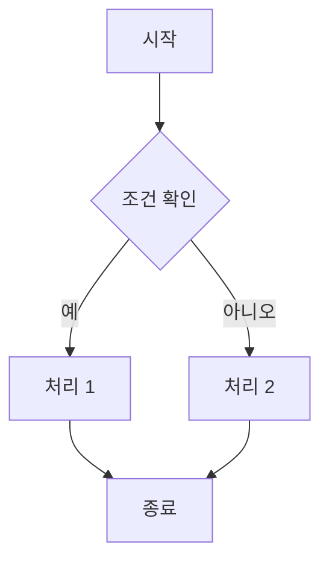

# 두루미 WYSIWYG 모드 종합 테스트

이 문서는 **WYSIWYG 모드**에서 모든 widget이 활성/비활성 라인에 무관하게 동일하게 렌더되는지, 그리고 각 widget 주변에서 **한글 IME composition**이 안전하게 작동하는지를 검증하기 위한 마크다운입니다.

테스트 방법:
1. 상태바 W 아이콘 또는 `Cmd+Shift+1`로 **WYSIWYG 모드** 진입
2. 각 섹션의 라인을 클릭(활성화) → 비활성 상태와 동일하게 보이는지 확인
3. 한글 IME가 켜진 상태에서 각 widget 주변에 한글을 타이핑 → 깨지지 않는지 확인

---

## 1. 인라인 마커 (Inline Markers)

**굵게**, *기울임*, ~~취소선~~, `인라인 코드`, 그리고 `<sup>위첨자</sup>`와 `<sub>아래첨자</sub>`도 한 줄에 같이 넣어봅니다. 한글 가운데 **굵은 한국어**나 *기울임 한국어*를 혼합해도 자연스러워야 합니다.

H<sub>2</sub>O는 물의 분자식이고, e=mc<sup>2</sup>는 질량-에너지 등가식입니다. 라이브러리 함수는 `parseInt()`나 `Array.from()`처럼 표기합니다.

backslash-escaped 마커도 시험: 글자 `\*` 그대로, 글자 `\#` 그대로, 글자 `\[` 그대로 보여야 합니다.

## 2. 제목 (Headings)

### 3단계 제목 — 활성화 시에도 `### ` 마커가 안 보여야 함

#### 4단계 제목 — 한글 제목

##### 5단계 제목

###### 6단계 제목

## 3. 인용문 (Blockquote)

> 인용문은 `> ` 마커가 활성화 시에도 안 보여야 합니다.
>
> 두 번째 단락. 한글로 길게 적어보고 IME 입력도 시도해봅니다. 강아지가 산책 가고 싶어합니다.

## 4. 리스트 (List)

### 4.1 순서 없는 리스트

- 첫 번째 항목 — 한글 내용
- 두 번째 항목 — 영문도 섞어서 mixed content
- 세 번째 항목
  - 중첩된 항목
  - 또 다른 중첩

### 4.2 번호 매기기 리스트

1. 첫 번째 — `1. ` 같은 list marker는 보여야 정상 (Word도 같음)
2. 두 번째 — 활성화 시에도 `1.` `2.` 등이 그대로 보여야 함
3. 세 번째 — `[Your Department]` 같은 placeholder는 brackets 숨김
4. 네 번째 — `mgkim@jbnu.ac.kr` 같은 email autolink는 보여야 함

### 4.3 작업 목록 (Task List) — checkbox widget

- [x] 완료된 작업 — 체크박스가 활성 줄에서도 렌더되어야 함
- [ ] 미완료 작업 — 한글 작업 내용으로 IME 입력 테스트
- [x] 또 다른 완료 — `[x]` 부분에 커서 두고 한글 합성 시도

## 5. 링크 (Links)

- 일반 링크 (URL 있음): [두루미 GitHub](https://github.com/kimmingul/durumi) — Word 스타일 밑줄+색 유지
- Placeholder 링크 (URL 없음): [Your Department] — 활성 줄에서도 brackets 숨김 + plain text
- Reference 링크: [Durumi 프로젝트][durumi]
- 이메일 autolink: mgkim@jbnu.ac.kr (사라지면 안 됨)
- 명시적 autolink: <https://example.com>

[durumi]: https://github.com/kimmingul/durumi

## 6. 이미지 (Image)

이미지 widget이 활성 라인에서도 렌더되어야 합니다. 이미지 라인 옆 본문에서 한글 IME composition 시도:

이미지 직전 본문 한글입니다.

이미지 직후 본문 한글입니다. 여기에 커서 두고 IME로 "한글입력" 시도해보세요.

## 7. 코드 (Code)

### 7.1 인라인 코드

`const 이름 = '한글변수명';` — 한글 변수명 포함

### 7.2 코드 블록

```typescript
// 한글 주석도 코드 블록 안에서 잘 보여야 함
function 인사하다(이름: string): string {
  return `안녕하세요, ${이름}님!`;
}
```

```python
# Python도 한글 코드
def 합산(목록):
    return sum(목록)
```

## 8. 수식 (Math)

### 8.1 인라인 수식

본문 중에 $x^2 + y^2 = z^2$ 처럼 수식이 들어가고, 그 옆에 한글이 이어집니다. 활성 줄에서도 수식이 렌더되어야 합니다.

오일러 항등식 $e^{i\pi} + 1 = 0$은 가장 아름다운 수식이라고 합니다.

### 8.2 블록 수식

다음은 베이즈 정리입니다:

$$
P(A|B) = \frac{P(B|A) \cdot P(A)}{P(B)}
$$

수식 블록 다음 본문 한글입니다. 수식 블록 안에 한글 주석이 들어가도 깨지지 않아야 합니다.

## 9. 표 (Table)

표 widget이 활성 라인에서도 렌더되어야 하고, 셀에 한글을 입력할 수 있어야 합니다.

| 항목 | 값 | 단위 | 비고 |
|:--|:--:|:--:|:--|
| 체중 | 65 | kg | 측정일 기준 |
| 신장 | 170 | cm | — |
| BMI | 22.5 | — | 정상 범위 |
| 혈압 | 120/80 | mmHg | 안정 시 |

표 다음 본문에서 한글 IME 합성 테스트. 표 셀 안에 커서 두고 한글 입력도 시도해보세요.

## 10. 각주 (Footnote)

이 문장에는 각주가 붙습니다[^1]. 그리고 두 번째 각주[^연구노트]도 있습니다. 각주 reference pill 옆에서 한글 IME 합성을 시도해보세요.

[^1]: 첫 번째 각주의 정의. 본문에 표시될 텍스트입니다.
[^연구노트]: 두 번째 각주. 한글 라벨도 사용 가능한지 확인.

## 11. 인용 (Citation — Durumi 고유)

이 부분은 의학연구에서 자주 쓰는 인용 syntax입니다. `[@key]` pill widget이 활성 줄에서도 렌더되어야 합니다.

선행 연구 [@smith2024deep]에 따르면, 새로운 모델이 기존 baseline [@jones2023bench] 대비 15% 향상을 보였다. 이 분야의 종합적 review는 [@kim2025review] 참고.

복수 인용도 가능 [@smith2024deep; @jones2023bench; @kim2025review].

## 12. Mermaid 다이어그램



Mermaid widget 다음에 한글 본문이 이어집니다.

## 13. 가로선 (Horizontal Rule)

가로선 위 본문 한글.

---

가로선 사이 본문 한글.

***

가로선 별표 형식.

___

가로선 언더스코어 형식.

## 14. CriticMarkup (검토 추적)

원본 텍스트에 {++추가된 내용++}이 있고, {--삭제된 내용--}도 있습니다. {~~기존 텍스트~>새 텍스트~~}로 교체된 부분도 있고, {==강조된 부분==}도 있습니다. {>>리뷰어 의견<<}도 있습니다.

## 15. 매뉴스크립트 예시 (실제 사용자 manuscript)

# Model-dependent behavioural bias in large-language-model synthetic-patient simulation

**Authors:** [Your Name]<sup>1</sup>, Min-Gul Kim<sup>2,3,4,\*</sup>

**Affiliations:**

1. [Your Department], Jeonbuk National University Hospital, Jeonju, Republic of Korea
2. Nanum Space Co., Ltd, Jeonju, Jeonbuk, Republic of Korea
3. Center for Clinical Pharmacology and Biomedical Research Institute, Jeonbuk National University Hospital, Jeonju, Republic of Korea
4. Department of Pharmacology, Jeonbuk National University Medical School, Jeonju, Republic of Korea

\*Corresponding author: Min-Gul Kim, MD, PhD; mgkim@jbnu.ac.kr; ORCID: [to be added]

---

## 16. IME composition 집중 테스트

이 섹션에서 각 줄을 클릭(활성화)하고 한글 IME로 "한국어가나다라마바사아자차카타파하" 같은 긴 입력을 시도해 보세요.

- 줄 1: 일반 텍스트 — 가나다라마바사
- 줄 2: **굵은 글씨 안에 한글** — 가나다라마바사
- 줄 3: 이미지 옆  한글
- 줄 4: 표 직후 한글 본문
- 줄 5: 수식 $\alpha + \beta$ 옆 한글
- 줄 6: 인용 [@smith2024deep] 옆 한글
- 줄 7: 각주 안의[^3] 한글
- 줄 8: link 옆 [예시](https://example.com) 한글

[^3]: 줄 7의 각주 정의.

---

## 검증 체크리스트

각 항목을 활성/비활성으로 비교하고 한글 IME 합성 시도:

- [ ] 1. 인라인 마커 — 활성/비활성 동일
- [ ] 2. 제목 — `#`/`##`/`###` 안 보임
- [ ] 3. 인용문 — `>` 안 보임
- [ ] 4.1 순서 없는 리스트 — `-` bullet
- [ ] 4.2 번호 리스트 — `1.` `2.` 그대로 보임
- [ ] 4.3 작업 목록 — 체크박스 활성 줄 렌더
- [ ] 5. 링크 — placeholder는 plain, 실제 링크는 underline
- [ ] 6. 이미지 — 활성 줄에서도 이미지 렌더 + 옆에 한글 IME OK
- [ ] 7.1 인라인 코드 — 활성 줄에서도 monospace
- [ ] 7.2 코드 블록 — syntax highlight
- [ ] 8.1 인라인 수식 — 활성 줄에서도 KaTeX 렌더
- [ ] 8.2 블록 수식 — 활성 줄에서도 KaTeX block 렌더
- [ ] 9. 표 — 활성 줄에서도 표 렌더 + 셀 한글 입력
- [ ] 10. 각주 — pill widget 활성 줄 렌더
- [ ] 11. 인용 (Citation) — pill widget 활성 줄 렌더
- [ ] 12. Mermaid — 활성 줄에서도 다이어그램 렌더
- [ ] 13. 가로선 — 활성 줄에서도 `---` → `<hr>`
- [ ] 14. CriticMarkup — 색상 표시 동일
- [ ] 15. 사용자 manuscript — 종합 확인
- [ ] 16. IME 집중 테스트 — 각 줄에서 한글 합성 안 깨짐

깨지는 widget 있으면 어떤 항목인지 알려주세요.
